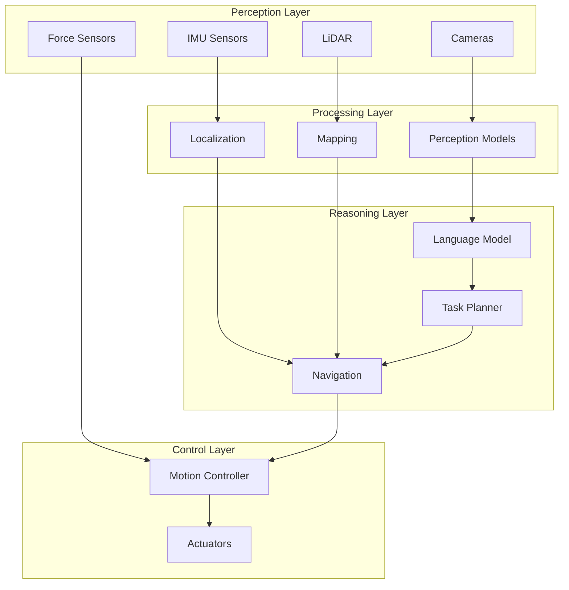

# Introduction to Physical AI

## Conceptual Overview

**Physical AI** represents a fundamental shift in how we think about artificial intelligence. While traditional AI excels at processing data, recognizing patterns, and generating text, Physical AI extends these capabilities into the real world—where machines must perceive their environment, reason about physical constraints, and take actions that have real consequences.

```
┌─────────────────────────────────────────────────────────────────┐
│                        PHYSICAL AI                               │
│                                                                  │
│   ┌──────────┐    ┌──────────┐    ┌──────────┐    ┌──────────┐ │
│   │  SENSE   │───▶│  THINK   │───▶│   PLAN   │───▶│   ACT    │ │
│   │ (Sensors)│    │   (AI)   │    │(Planning)│    │(Actuators)│ │
│   └──────────┘    └──────────┘    └──────────┘    └──────────┘ │
│        ▲                                               │        │
│        └───────────────────────────────────────────────┘        │
│                      FEEDBACK LOOP                               │
└─────────────────────────────────────────────────────────────────┘
```

**Key Insight**: Intelligence reaches its full potential only when it is embodied. Physical AI bridges the digital brain and the physical body, enabling machines to perceive, reason, and act in the real world.

## The Core Thesis

This book is built on a fundamental premise:

> **Embodied intelligence is not just digital AI with a body attached—it requires fundamentally different approaches to perception, planning, and action.**

Consider the difference between:
- **Digital AI**: "Describe how to pick up a cup"
- **Physical AI**: Actually picking up a cup while accounting for grip force, object weight, surface friction, arm dynamics, and real-time visual feedback

The second task requires:
1. **Continuous perception** - Cameras and sensors providing real-time data
2. **Physical reasoning** - Understanding forces, collisions, and dynamics
3. **Closed-loop control** - Adjusting actions based on feedback
4. **Failure handling** - Recovering when things don't go as planned

## System Architecture

A Physical AI system integrates multiple layers:



**Components**:
- **Perception Layer**: Sensors that capture the state of the world
- **Processing Layer**: Models that interpret sensor data
- **Reasoning Layer**: AI that plans and decides
- **Control Layer**: Systems that execute physical actions

## Core Technologies

This book covers the essential technologies for building Physical AI systems:

| Technology | Version | Purpose |
|------------|---------|---------|
| ROS 2 | Humble (LTS) | Robotic middleware for communication |
| Gazebo | Sim (Ignition) | Physics simulation |
| NVIDIA Isaac | ROS + Sim | AI perception and navigation |
| Nav2 | Latest | Autonomous navigation |
| Whisper | OpenAI | Speech-to-text |
| LLM | API-based | Task planning and reasoning |

**Verification**: Ensure you have the prerequisites:

```bash
# Check ROS 2
ros2 --version

# Check Python
python3 --version  # Should be 3.10+

# Check Node.js (for this documentation)
node --version  # Should be 18+
```

## What Makes This Book Different

### Physical-First Approach

Every concept in this book is grounded in physical reality:

| Concept | Digital AI | Physical AI (This Book) |
|---------|------------|-------------------------|
| Perception | Process images | Continuous sensor fusion |
| Planning | Generate text | Account for physics |
| Execution | Output tokens | Control actuators |
| Feedback | None | Closed-loop control |

### Simulation-to-Real Mindset

We design every system with the assumption it will run on real hardware:

- **Determinism**: Reproducible behavior
- **Latency awareness**: Real-time constraints
- **Noise handling**: Sensor uncertainty
- **Failure modes**: What breaks and how to fix it

### Quality Bar

Throughout this book, we apply a consistent quality test:

:::info Quality Bar
Would this explanation allow a motivated engineer to reproduce the system without guessing?

If the answer is no, the content must be revised.
:::

## Hands-on Implementation

This book is not just theory—every module includes runnable code. Here's a preview of what you'll build:

### Module 1: ROS 2 Nervous System
```python
# Publisher node that sends joint commands
import rclpy
from rclpy.node import Node
from std_msgs.msg import Float64MultiArray

class JointPublisher(Node):
    def __init__(self):
        super().__init__('joint_publisher')
        self.publisher = self.create_publisher(
            Float64MultiArray,
            '/joint_commands',
            10
        )
```

### Module 5: Capstone Pipeline
```
Voice: "Pick up the red cup"
    ↓
Whisper: "pick up the red cup"
    ↓
LLM: [navigate_to(table), detect(red_cup), grasp(red_cup)]
    ↓
ROS 2: Execute action sequence
    ↓
Robot: Physically picks up cup
```

## Failure Modes & Debugging

Physical AI systems fail in ways digital systems don't:

### Issue: Sensor Noise

**Symptoms**: Erratic robot behavior, sudden movements

**Diagnosis**:
```bash
ros2 topic echo /imu/data --once
# Check for unrealistic values or high variance
```

**Resolution**: Apply sensor filtering, verify hardware connections

### Issue: Timing Violations

**Symptoms**: Jerky motion, missed commands

**Diagnosis**:
```bash
ros2 topic hz /joint_states
# Should be consistent (e.g., 100 Hz)
```

**Resolution**: Check CPU load, optimize node execution

## What's Next

**You learned**:
- Physical AI extends digital AI into the real world
- Embodied intelligence requires perception, reasoning, and action
- The core architecture: sensors → processing → reasoning → control
- Quality bar: "Can a motivated engineer reproduce without guessing?"

**Coming up**: Module 1 - The Robotic Nervous System (ROS 2)

You'll learn how ROS 2 provides the communication infrastructure that connects all components of a Physical AI system.

**Prerequisites for next**:
- [ ] Understand the Physical AI architecture
- [ ] Have Python 3.10+ installed
- [ ] Ready to install ROS 2 Humble
