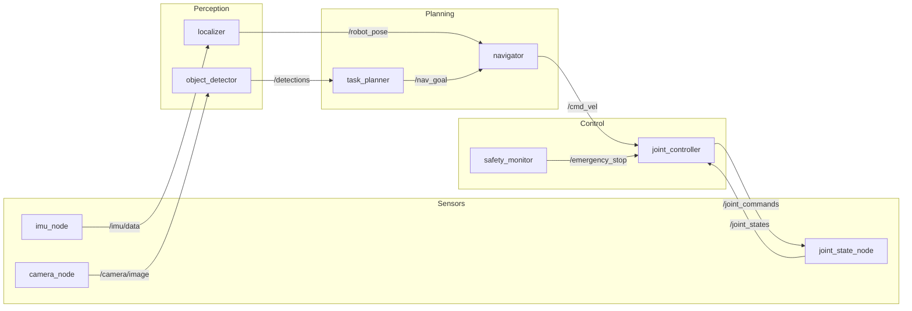

# ROS 2 as the Robotic Nervous System

## Conceptual Overview

Just as the human nervous system transmits signals between the brain, sensors, and muscles, **ROS 2 (Robot Operating System 2)** serves as the communication backbone for Physical AI systems. It enables different software components to exchange data, coordinate actions, and respond to the physical world in real-time.

```
┌────────────────────────────────────────────────────────────────────┐
│                    HUMANOID NERVOUS SYSTEM                          │
│                                                                     │
│   ┌─────────────┐                           ┌─────────────┐        │
│   │   SENSORS   │                           │  ACTUATORS  │        │
│   │ (Eyes, IMU) │                           │  (Motors)   │        │
│   └──────┬──────┘                           └──────▲──────┘        │
│          │                                         │               │
│          ▼         ROS 2 MESSAGE BUS               │               │
│   ┌──────────────────────────────────────────────────────────┐    │
│   │  ════════════════════════════════════════════════════    │    │
│   │         Topics    Services    Actions    Parameters       │    │
│   └──────────────────────────────────────────────────────────┘    │
│          │                                         ▲               │
│          ▼                                         │               │
│   ┌─────────────┐    ┌─────────────┐    ┌─────────────┐          │
│   │ PERCEPTION  │───▶│   PLANNING  │───▶│  CONTROL    │          │
│   │    NODE     │    │    NODE     │    │    NODE     │          │
│   └─────────────┘    └─────────────┘    └─────────────┘          │
└────────────────────────────────────────────────────────────────────┘
```

**Key Insight**: ROS 2 doesn't make your robot intelligent—it provides the nervous system that lets intelligent components communicate. Without ROS 2, your AI brain couldn't receive sensor data or command actuators.

## Why ROS 2 for Physical AI?

### The Problem ROS 2 Solves

Building a humanoid robot requires integrating dozens of components:
- Multiple cameras
- IMU sensors
- Joint encoders
- Motor controllers
- Perception algorithms
- Planning systems
- Safety monitors

Without a framework like ROS 2, you'd need to write custom communication protocols between every pair of components—an exponentially growing nightmare.

### ROS 2 Core Concepts

| Concept | Human Analogy | Robot Function |
|---------|---------------|----------------|
| **Node** | Neuron cluster | Independent process performing one task |
| **Topic** | Neural pathway | One-way data stream (publish/subscribe) |
| **Service** | Reflex arc | Request/response interaction |
| **Action** | Complex motor skill | Long-running task with feedback |
| **Parameter** | Memory/settings | Configuration values |

## System Architecture

### ROS 2 Node Graph

A typical humanoid robot ROS 2 system:



**Components**:
- **Sensor Nodes**: Publish raw data at high frequency
- **Perception Nodes**: Process sensor data into meaningful information
- **Planning Nodes**: Decide what actions to take
- **Control Nodes**: Execute commands on hardware

## Core Technologies

| Technology | Version | Purpose |
|------------|---------|---------|
| ROS 2 | Humble Hawksbill | LTS release (until 2027) |
| Python | 3.10+ | Node implementation (rclpy) |
| C++ | 17+ | Performance-critical nodes (rclcpp) |
| DDS | Various | Underlying communication |

**Verification**:

```bash
# Install ROS 2 Humble (Ubuntu 22.04)
sudo apt update
sudo apt install ros-humble-desktop

# Source the installation
source /opt/ros/humble/setup.bash

# Verify installation
ros2 --version
# Expected: ros2 0.x.x
```

## Hands-on Implementation

### Step 1: Create Your First ROS 2 Workspace

```bash
# Create workspace directory
mkdir -p ~/ros2_ws/src
cd ~/ros2_ws

# Build empty workspace
colcon build

# Source the workspace
source install/setup.bash
```

### Step 2: Create a Minimal Package

```bash
cd ~/ros2_ws/src

# Create Python package
ros2 pkg create --build-type ament_python humanoid_basics \
    --dependencies rclpy std_msgs
```

### Step 3: Understand the Package Structure

```
humanoid_basics/
├── package.xml          # Package metadata and dependencies
├── setup.py             # Python package setup
├── setup.cfg            # Entry points configuration
├── humanoid_basics/     # Python module
│   └── __init__.py
├── resource/            # Package marker
│   └── humanoid_basics
└── test/                # Test files
```

### Step 4: Your First Node (Conceptual)

```python
#!/usr/bin/env python3
"""
Code Example: Minimal ROS 2 Node

Problem Solved: Demonstrates the basic structure of a ROS 2 node
Assumptions: ROS 2 Humble installed, workspace sourced
Failure Modes: Node won't start if ROS 2 not sourced

Input: None
Output: Prints "Hello Physical AI!" to console

Usage:
    ros2 run humanoid_basics minimal_node
"""

import rclpy
from rclpy.node import Node


class MinimalNode(Node):
    """
    A minimal ROS 2 node demonstrating basic structure.

    WHY: Every ROS 2 program needs at least one node.
    Nodes are the fundamental units of computation in ROS 2.
    """

    def __init__(self):
        # Initialize the node with a name
        # WHY: The name identifies this node in the ROS 2 graph
        super().__init__('minimal_node')

        # Log that we've started
        # WHY: Logging helps debug node lifecycle issues
        self.get_logger().info('Hello Physical AI!')


def main(args=None):
    # Initialize ROS 2 client library
    # WHY: Must be called before creating any nodes
    rclpy.init(args=args)

    # Create our node
    node = MinimalNode()

    # Keep the node running
    # WHY: spin() processes callbacks until shutdown
    rclpy.spin(node)

    # Cleanup
    # WHY: Proper shutdown prevents resource leaks
    node.destroy_node()
    rclpy.shutdown()


if __name__ == '__main__':
    main()
```

**Expected Output**:
```
[INFO] [minimal_node]: Hello Physical AI!
```

## Failure Modes & Debugging

### Issue: "Package not found" Error

**Symptoms**: `ros2 run` fails with package not found

**Diagnosis**:
```bash
# Check if package is built
ros2 pkg list | grep humanoid_basics

# Check if workspace is sourced
echo $AMENT_PREFIX_PATH
```

**Resolution**:
1. Rebuild: `colcon build`
2. Re-source: `source install/setup.bash`

### Issue: Node Starts but Does Nothing

**Symptoms**: No output, no errors

**Diagnosis**:
```bash
# List running nodes
ros2 node list

# Check node info
ros2 node info /minimal_node
```

**Resolution**: Ensure `rclpy.spin()` is called, check for silent exceptions

### Issue: ROS 2 Command Not Found

**Symptoms**: `ros2: command not found`

**Diagnosis**:
```bash
# Check if ROS 2 is installed
ls /opt/ros/

# Check environment
echo $ROS_DISTRO
```

**Resolution**: Source ROS 2: `source /opt/ros/humble/setup.bash`

## What's Next

**You learned**:
- ROS 2 is the "nervous system" connecting Physical AI components
- Nodes are independent processes that communicate via topics, services, and actions
- A ROS 2 workspace organizes your packages
- Basic node structure with initialization, spin, and shutdown

**Coming up**: Lesson 2 - Nodes & Topics

You'll learn how nodes communicate using the publish/subscribe pattern—the foundation of real-time sensor data streaming.

**Prerequisites for next**:
- [ ] ROS 2 Humble installed
- [ ] Created `ros2_ws` workspace
- [ ] Understand basic node structure
