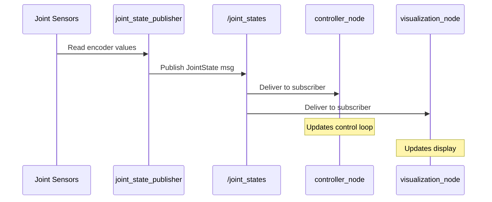

# Nodes & Topics: The Publish/Subscribe Pattern

## Conceptual Overview

In Physical AI systems, sensors generate data continuously—cameras at 30 FPS, IMUs at 100+ Hz, joint encoders at 1000 Hz. **Topics** provide a way to stream this data from producers (publishers) to consumers (subscribers) without tight coupling between components.

```
┌───────────────────────────────────────────────────────────────────┐
│                  PUBLISH/SUBSCRIBE PATTERN                         │
│                                                                    │
│   ┌──────────────┐                      ┌──────────────┐          │
│   │   CAMERA     │                      │   OBJECT     │          │
│   │   NODE       │                      │   DETECTOR   │          │
│   │              │                      │              │          │
│   │  Publisher ──┼──┐                ┌──┼── Subscriber │          │
│   └──────────────┘  │                │  └──────────────┘          │
│                     │                │                            │
│                     ▼                │                            │
│              ┌─────────────────┐     │                            │
│              │  /camera/image  │─────┘                            │
│              │     (Topic)     │─────┐                            │
│              └─────────────────┘     │                            │
│                     ▲                │                            │
│                     │                ▼                            │
│   ┌──────────────┐  │       ┌──────────────┐                     │
│   │   LOGGING    │──┘       │   DISPLAY    │                     │
│   │   NODE       │          │   NODE       │                     │
│   │  Subscriber  │          │  Subscriber  │                     │
│   └──────────────┘          └──────────────┘                     │
└───────────────────────────────────────────────────────────────────┘
```

**Key Insight**: Publishers don't know (or care) who subscribes to their data. This decoupling allows you to add new components (like a recorder or visualizer) without modifying existing code.

## System Architecture

### Topic Communication Flow

For a humanoid robot's joint state monitoring:



### Message Types

ROS 2 uses typed messages to ensure data integrity:

| Message Type | Use Case | Example Fields |
|--------------|----------|----------------|
| `std_msgs/Float64` | Single sensor value | `data: 3.14` |
| `sensor_msgs/JointState` | Joint positions/velocities | `position[], velocity[]` |
| `sensor_msgs/Image` | Camera frames | `data, height, width, encoding` |
| `geometry_msgs/Twist` | Velocity commands | `linear.x, angular.z` |

## Core Technologies

| Technology | Version | Purpose |
|------------|---------|---------|
| rclpy | Humble | Python client library |
| std_msgs | Humble | Standard message types |
| sensor_msgs | Humble | Sensor message types |

**Verification**:
```bash
# List available message types
ros2 interface list | grep sensor_msgs

# Show message definition
ros2 interface show sensor_msgs/msg/JointState
```

## Hands-on Implementation

### Step 1: Create a Publisher Node

```python
#!/usr/bin/env python3
"""
Code Example: Joint State Publisher

Problem Solved: Publishes simulated joint states at 10 Hz
Assumptions: ROS 2 Humble, sensor_msgs available
Failure Modes: If timer fails, no data published

Input: None (generates synthetic data)
Output: JointState messages on /joint_states topic

Usage:
    ros2 run humanoid_basics joint_publisher
"""

import rclpy
from rclpy.node import Node
from sensor_msgs.msg import JointState
import math


class JointPublisher(Node):
    """
    Publishes simulated joint states for a humanoid robot.

    WHY: Sensors in real robots publish data continuously.
    This simulates that behavior for testing without hardware.
    """

    def __init__(self):
        super().__init__('joint_publisher')

        # Create publisher
        # WHY: QoS depth of 10 buffers messages if subscriber is slow
        self.publisher = self.create_publisher(
            JointState,
            '/joint_states',
            10  # QoS depth
        )

        # Define joint names
        # WHY: Humanoids have many joints; we start with key ones
        self.joint_names = [
            'left_shoulder_pitch',
            'left_shoulder_roll',
            'left_elbow',
            'right_shoulder_pitch',
            'right_shoulder_roll',
            'right_elbow',
        ]

        # Timer for periodic publishing
        # WHY: 10 Hz is typical for joint state visualization
        self.timer = self.create_timer(0.1, self.publish_joint_states)

        self.start_time = self.get_clock().now()
        self.get_logger().info('Joint publisher started')

    def publish_joint_states(self):
        """Publish current joint positions."""
        msg = JointState()
        msg.header.stamp = self.get_clock().now().to_msg()
        msg.name = self.joint_names

        # Generate sinusoidal motion for demonstration
        # WHY: Shows time-varying data; real robots have actual sensor values
        elapsed = (self.get_clock().now() - self.start_time).nanoseconds / 1e9
        msg.position = [
            0.5 * math.sin(elapsed),           # left_shoulder_pitch
            0.3 * math.sin(elapsed * 0.5),     # left_shoulder_roll
            0.8 * math.sin(elapsed * 2),       # left_elbow
            0.5 * math.sin(elapsed + 3.14),    # right_shoulder_pitch
            0.3 * math.sin(elapsed * 0.5 + 1), # right_shoulder_roll
            0.8 * math.sin(elapsed * 2 + 1.5), # right_elbow
        ]
        msg.velocity = [0.0] * len(self.joint_names)
        msg.effort = [0.0] * len(self.joint_names)

        self.publisher.publish(msg)


def main(args=None):
    rclpy.init(args=args)
    node = JointPublisher()
    rclpy.spin(node)
    node.destroy_node()
    rclpy.shutdown()


if __name__ == '__main__':
    main()
```

### Step 2: Create a Subscriber Node

```python
#!/usr/bin/env python3
"""
Code Example: Joint State Subscriber

Problem Solved: Receives and processes joint state data
Assumptions: Publisher is running on /joint_states
Failure Modes: No callback if publisher not running

Input: JointState messages from /joint_states
Output: Logs joint positions to console

Usage:
    ros2 run humanoid_basics joint_subscriber
"""

import rclpy
from rclpy.node import Node
from sensor_msgs.msg import JointState


class JointSubscriber(Node):
    """
    Subscribes to joint states and logs them.

    WHY: Controllers need to know current joint positions
    before commanding new positions.
    """

    def __init__(self):
        super().__init__('joint_subscriber')

        # Create subscription
        # WHY: Callback is invoked whenever a message arrives
        self.subscription = self.create_subscription(
            JointState,
            '/joint_states',
            self.joint_callback,
            10  # QoS depth
        )

        self.get_logger().info('Joint subscriber started')

    def joint_callback(self, msg: JointState):
        """
        Process incoming joint state message.

        WHY: This is where you'd implement control logic
        or forward data to other systems.
        """
        # Log first joint for brevity
        if msg.name and msg.position:
            self.get_logger().info(
                f'{msg.name[0]}: {msg.position[0]:.3f} rad'
            )


def main(args=None):
    rclpy.init(args=args)
    node = JointSubscriber()
    rclpy.spin(node)
    node.destroy_node()
    rclpy.shutdown()


if __name__ == '__main__':
    main()
```

### Step 3: Run Both Nodes

**Terminal 1 - Publisher**:
```bash
source ~/ros2_ws/install/setup.bash
ros2 run humanoid_basics joint_publisher
```

**Terminal 2 - Subscriber**:
```bash
source ~/ros2_ws/install/setup.bash
ros2 run humanoid_basics joint_subscriber
```

**Expected Output** (Subscriber):
```
[INFO] [joint_subscriber]: Joint subscriber started
[INFO] [joint_subscriber]: left_shoulder_pitch: 0.048 rad
[INFO] [joint_subscriber]: left_shoulder_pitch: 0.097 rad
[INFO] [joint_subscriber]: left_shoulder_pitch: 0.145 rad
```

### Step 4: Inspect with CLI Tools

```bash
# List active topics
ros2 topic list

# Show topic info
ros2 topic info /joint_states

# Echo messages (useful for debugging)
ros2 topic echo /joint_states

# Check publishing rate
ros2 topic hz /joint_states
# Expected: average rate: 10.0 Hz
```

## Failure Modes & Debugging

### Issue: Subscriber Receives No Messages

**Symptoms**: Callback never invoked, no errors

**Diagnosis**:
```bash
# Check if topic exists
ros2 topic list | grep joint_states

# Check if messages are being published
ros2 topic echo /joint_states --once

# Verify QoS compatibility
ros2 topic info /joint_states -v
```

**Resolution**:
1. Ensure publisher is running
2. Check topic name spelling (exact match required)
3. Verify QoS settings are compatible

### Issue: Messages Arriving Late or Dropped

**Symptoms**: Inconsistent data, gaps in logging

**Diagnosis**:
```bash
# Check actual publishing rate
ros2 topic hz /joint_states

# Check for network issues
ros2 topic delay /joint_states
```

**Resolution**:
1. Increase QoS depth for bursty data
2. Use `BEST_EFFORT` reliability for high-frequency data
3. Check CPU load on subscriber node

### Issue: Wrong Message Type Error

**Symptoms**: `TypeError` or serialization errors

**Diagnosis**:
```bash
# Check message type on topic
ros2 topic info /joint_states

# Compare with expected type
ros2 interface show sensor_msgs/msg/JointState
```

**Resolution**: Ensure publisher and subscriber use the same message type

## What's Next

**You learned**:
- Topics enable decoupled, one-to-many communication
- Publishers send data without knowing who receives it
- Subscribers register callbacks for incoming messages
- CLI tools (`ros2 topic`) help debug communication

**Coming up**: Lesson 3 - Services & Actions

Topics are great for streaming data, but what about request/response patterns or long-running tasks? Services and actions fill these gaps.

**Prerequisites for next**:
- [ ] Publisher and subscriber nodes working
- [ ] Comfortable with `ros2 topic` commands
- [ ] Understand callback-based programming
