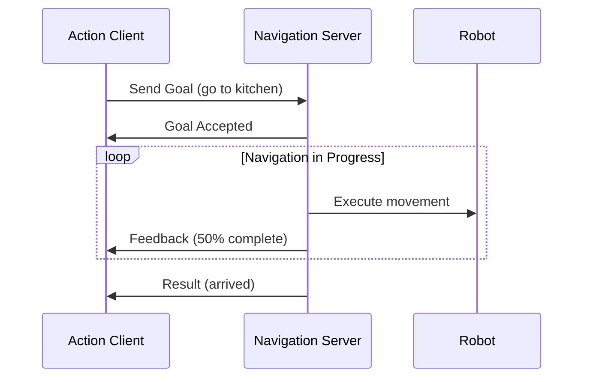

# Services & Actions: Beyond Streaming Data

## Conceptual Overview

While topics excel at continuous data streaming, Physical AI systems also need:

1. **Services**: Synchronous request/response (like asking "What's the current battery level?")
2. **Actions**: Long-running tasks with feedback (like "Walk to the kitchen")

```
┌───────────────────────────────────────────────────────────────────────┐
│                   COMMUNICATION PATTERNS                               │
│                                                                        │
│   TOPICS (Pub/Sub)          SERVICES (Req/Res)     ACTIONS (Goal)     │
│   ─────────────────         ────────────────────   ────────────────   │
│                                                                        │
│   Publisher ──▶ Topic       Client ──▶ Server      Client ──▶ Server  │
│                  │            │           │          │          │      │
│                  ▼            │  Request  │          │  Goal    │      │
│              Subscriber       │◀──────────│          │◀─────────│      │
│                               │           │          │          │      │
│   • One-way                   │  Response │          │ Feedback │      │
│   • Many receivers            │──────────▶│          │─────────▶│      │
│   • No confirmation           │           │          │  Result  │      │
│                               └───────────┘          │◀─────────│      │
│   Use: Sensor data            Use: Quick queries     │          │      │
│                                                      └──────────┘      │
│                                                      Use: Navigation   │
└───────────────────────────────────────────────────────────────────────┘
```

**Key Insight**: Use topics for "fire and forget" data, services for quick queries, and actions for tasks that take time and need progress updates.

## System Architecture

### When to Use Each Pattern

| Pattern | Use Case | Example |
|---------|----------|---------|
| **Topic** | Continuous data stream | Joint states at 100 Hz |
| **Service** | Quick request/response | Get battery percentage |
| **Action** | Long-running with feedback | Navigate to waypoint |

### Action Communication Flow



## Core Technologies

| Technology | Version | Purpose |
|------------|---------|---------|
| rclpy.service | Humble | Service client/server |
| rclpy.action | Humble | Action client/server |
| example_interfaces | Humble | Basic service types |
| action_msgs | Humble | Action infrastructure |

**Verification**:
```bash
# List available service types
ros2 interface list | grep srv

# List available action types
ros2 interface list | grep action
```

## Hands-on Implementation

### Part A: Services

#### Step 1: Create a Service Server

```python
#!/usr/bin/env python3
"""
Code Example: Battery Status Service

Problem Solved: Provides battery level on request
Assumptions: ROS 2 Humble, example_interfaces available
Failure Modes: Service unavailable if node crashes

Input: Empty request
Output: Battery percentage (0-100)

Usage:
    ros2 run humanoid_basics battery_service
"""

import rclpy
from rclpy.node import Node
from example_interfaces.srv import Trigger
import random


class BatteryService(Node):
    """
    Service that reports simulated battery level.

    WHY: Controllers need to check battery before
    starting long tasks to avoid mid-task shutdowns.
    """

    def __init__(self):
        super().__init__('battery_service')

        # Create service
        # WHY: Trigger is a simple service with empty request
        # and success/message response
        self.srv = self.create_service(
            Trigger,
            '/get_battery_status',
            self.get_battery_callback
        )

        # Simulated battery level
        self.battery_level = 85.0

        self.get_logger().info('Battery service ready')

    def get_battery_callback(self, request, response):
        """
        Handle battery status request.

        WHY: Services block until response is sent,
        so keep computation minimal.
        """
        # Simulate slight battery drain
        self.battery_level -= random.uniform(0.1, 0.5)
        self.battery_level = max(0.0, self.battery_level)

        response.success = True
        response.message = f'Battery: {self.battery_level:.1f}%'

        self.get_logger().info(f'Reported battery: {self.battery_level:.1f}%')
        return response


def main(args=None):
    rclpy.init(args=args)
    node = BatteryService()
    rclpy.spin(node)
    node.destroy_node()
    rclpy.shutdown()


if __name__ == '__main__':
    main()
```

#### Step 2: Call the Service

**From CLI**:
```bash
# Call the service
ros2 service call /get_battery_status example_interfaces/srv/Trigger

# Expected output:
# success: true
# message: 'Battery: 84.7%'
```

**From Python** (Service Client):
```python
#!/usr/bin/env python3
"""
Code Example: Battery Status Client

Problem Solved: Queries battery level before starting task
Assumptions: Battery service is running
Failure Modes: Times out if service unavailable

Input: None
Output: Battery level from service

Usage:
    ros2 run humanoid_basics battery_client
"""

import rclpy
from rclpy.node import Node
from example_interfaces.srv import Trigger


class BatteryClient(Node):
    """
    Client that queries battery status.

    WHY: Check resources before committing to
    energy-intensive operations.
    """

    def __init__(self):
        super().__init__('battery_client')

        # Create client
        self.client = self.create_client(
            Trigger,
            '/get_battery_status'
        )

        # Wait for service to be available
        # WHY: Service might not be ready immediately at startup
        while not self.client.wait_for_service(timeout_sec=1.0):
            self.get_logger().warn('Waiting for battery service...')

    def check_battery(self):
        """Send request and wait for response."""
        request = Trigger.Request()

        # Call service (blocks until response)
        future = self.client.call_async(request)
        rclpy.spin_until_future_complete(self, future)

        if future.result() is not None:
            return future.result()
        else:
            self.get_logger().error('Service call failed')
            return None


def main(args=None):
    rclpy.init(args=args)
    client = BatteryClient()

    result = client.check_battery()
    if result:
        print(f'Battery status: {result.message}')

    client.destroy_node()
    rclpy.shutdown()


if __name__ == '__main__':
    main()
```

### Part B: Actions

#### Step 3: Understand Action Structure

Actions have three parts:
- **Goal**: What to achieve (e.g., target position)
- **Feedback**: Progress updates (e.g., distance remaining)
- **Result**: Final outcome (e.g., success/failure)

```python
# Example action definition (for reference)
# NavigateToPoint.action

# Goal
geometry_msgs/Point target_point
---
# Result
bool success
string message
---
# Feedback
float32 distance_remaining
float32 estimated_time_remaining
```

#### Step 4: Use a Built-in Action (Nav2 Example)

For navigation, Nav2 provides the `NavigateToPose` action:

```python
#!/usr/bin/env python3
"""
Code Example: Navigation Action Client (Conceptual)

Problem Solved: Sends navigation goals to Nav2
Assumptions: Nav2 stack running, action server available
Failure Modes: Goal rejected if path not found

Input: Target pose (x, y, orientation)
Output: Navigation result with feedback during execution

Usage:
    ros2 run humanoid_basics nav_client
"""

import rclpy
from rclpy.node import Node
from rclpy.action import ActionClient
from nav2_msgs.action import NavigateToPose
from geometry_msgs.msg import PoseStamped


class NavigationClient(Node):
    """
    Sends navigation goals and monitors progress.

    WHY: Humanoid navigation is a long-running task
    that needs progress feedback for safety monitoring.
    """

    def __init__(self):
        super().__init__('navigation_client')

        # Create action client
        self.action_client = ActionClient(
            self,
            NavigateToPose,
            '/navigate_to_pose'
        )

        self.get_logger().info('Navigation client ready')

    def send_goal(self, x: float, y: float):
        """Send navigation goal."""
        # Wait for action server
        self.action_client.wait_for_server()

        # Create goal
        goal_msg = NavigateToPose.Goal()
        goal_msg.pose = PoseStamped()
        goal_msg.pose.header.frame_id = 'map'
        goal_msg.pose.pose.position.x = x
        goal_msg.pose.pose.position.y = y
        goal_msg.pose.pose.orientation.w = 1.0

        # Send goal with feedback callback
        # WHY: Feedback lets us monitor progress and cancel if needed
        future = self.action_client.send_goal_async(
            goal_msg,
            feedback_callback=self.feedback_callback
        )
        future.add_done_callback(self.goal_response_callback)

    def goal_response_callback(self, future):
        """Handle goal acceptance/rejection."""
        goal_handle = future.result()

        if not goal_handle.accepted:
            self.get_logger().error('Goal rejected!')
            return

        self.get_logger().info('Goal accepted, navigating...')

        # Get result when done
        result_future = goal_handle.get_result_async()
        result_future.add_done_callback(self.result_callback)

    def feedback_callback(self, feedback_msg):
        """Process feedback during navigation."""
        feedback = feedback_msg.feedback
        # Log progress (actual fields depend on action type)
        self.get_logger().info(f'Navigating... feedback received')

    def result_callback(self, future):
        """Handle navigation result."""
        result = future.result().result
        self.get_logger().info('Navigation complete!')
```

## Failure Modes & Debugging

### Issue: Service Call Times Out

**Symptoms**: Client hangs, eventually fails

**Diagnosis**:
```bash
# Check if service exists
ros2 service list | grep battery

# Check service type
ros2 service type /get_battery_status
```

**Resolution**:
1. Ensure server node is running
2. Check service name spelling
3. Increase timeout in client

### Issue: Action Goal Rejected

**Symptoms**: `Goal rejected` message

**Diagnosis**:
```bash
# Check action server status
ros2 action list
ros2 action info /navigate_to_pose

# Check if server is busy
ros2 action info /navigate_to_pose -t
```

**Resolution**:
1. Verify goal parameters are valid
2. Check if another goal is in progress
3. Review server rejection reason

### Issue: No Feedback Received

**Symptoms**: Goal sent, no progress updates

**Diagnosis**:
```bash
# Monitor action feedback topic
ros2 topic echo /navigate_to_pose/_action/feedback
```

**Resolution**:
1. Verify feedback callback is registered
2. Check server is publishing feedback
3. Ensure goal was accepted

## What's Next

**You learned**:
- Services provide synchronous request/response communication
- Actions handle long-running tasks with progress feedback
- When to use topics vs services vs actions
- How to create service servers/clients and action clients

**Coming up**: Lesson 4 - Launch Files

You now have multiple nodes—publisher, subscriber, service, action client. Launch files let you start them all with a single command.

**Prerequisites for next**:
- [ ] Created and tested service server/client
- [ ] Understand action client basics
- [ ] Comfortable with async callbacks
