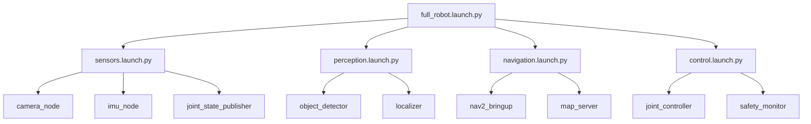

# Launch Files: Orchestrating Robot Systems

## Conceptual Overview

A humanoid robot system involves dozens of nodes: sensors, perception, planning, control, safety monitors. Starting each manually is impractical and error-prone. **Launch files** solve this by:

1. Starting multiple nodes with one command
2. Passing parameters and configurations
3. Setting up namespaces and remappings
4. Defining node dependencies

```
┌────────────────────────────────────────────────────────────────────┐
│                     LAUNCH FILE ORCHESTRATION                       │
│                                                                     │
│   $ ros2 launch humanoid_bringup full_robot.launch.py              │
│                           │                                         │
│                           ▼                                         │
│   ┌─────────────────────────────────────────────────────────────┐  │
│   │                    LAUNCH FILE                               │  │
│   │                                                              │  │
│   │  ┌─────────┐  ┌─────────┐  ┌─────────┐  ┌─────────┐        │  │
│   │  │ Sensors │  │ Percep- │  │ Planning│  │ Control │        │  │
│   │  │  Nodes  │  │  tion   │  │  Nodes  │  │  Nodes  │        │  │
│   │  └────┬────┘  └────┬────┘  └────┬────┘  └────┬────┘        │  │
│   │       │            │            │            │              │  │
│   │       ▼            ▼            ▼            ▼              │  │
│   │    Parameters   Remappings  Namespaces  Conditions         │  │
│   └─────────────────────────────────────────────────────────────┘  │
│                                                                     │
└────────────────────────────────────────────────────────────────────┘
```

**Key Insight**: Launch files are Python scripts that describe your robot system declaratively. They're version-controlled, parameterized, and composable—essential for reproducible robot deployments.

## System Architecture

### Launch File Hierarchy

Complex robots use hierarchical launch files:

```
humanoid_bringup/
├── launch/
│   ├── full_robot.launch.py      # Top-level: includes all subsystems
│   ├── sensors.launch.py         # Sensor nodes only
│   ├── perception.launch.py      # Perception nodes only
│   ├── navigation.launch.py      # Nav2 stack
│   └── simulation.launch.py      # Gazebo + robot
└── config/
    ├── robot_params.yaml         # Robot-specific parameters
    └── nav2_params.yaml          # Navigation parameters
```

### Typical Humanoid Launch Structure



## Core Technologies

| Technology | Version | Purpose |
|------------|---------|---------|
| launch | Humble | Launch framework |
| launch_ros | Humble | ROS 2 launch extensions |
| YAML | - | Parameter files |

**Verification**:
```bash
# Check launch is available
ros2 launch --help

# List launch files in a package
ros2 pkg executables humanoid_bringup
```

## Hands-on Implementation

### Step 1: Basic Launch File

```python
#!/usr/bin/env python3
"""
Code Example: Basic Humanoid Launch File

Problem Solved: Starts sensor nodes with one command
Assumptions: Nodes are built and installed in workspace
Failure Modes: Fails if nodes not found in package

Input: None
Output: Running sensor nodes

Usage:
    ros2 launch humanoid_basics sensors.launch.py
"""

from launch import LaunchDescription
from launch_ros.actions import Node


def generate_launch_description():
    """
    Generate launch description for sensor nodes.

    WHY: LaunchDescription is the return type expected
    by the ROS 2 launch system.
    """

    # Joint state publisher
    # WHY: Publishes current joint positions for visualization and control
    joint_publisher = Node(
        package='humanoid_basics',
        executable='joint_publisher',
        name='joint_publisher',
        output='screen',  # Show output in terminal
    )

    # Joint state subscriber (for monitoring)
    # WHY: Demonstrates multi-node launch
    joint_subscriber = Node(
        package='humanoid_basics',
        executable='joint_subscriber',
        name='joint_subscriber',
        output='screen',
    )

    return LaunchDescription([
        joint_publisher,
        joint_subscriber,
    ])
```

### Step 2: Launch File with Parameters

```python
#!/usr/bin/env python3
"""
Code Example: Parameterized Launch File

Problem Solved: Configures nodes via parameters and YAML files
Assumptions: Parameter file exists at specified path
Failure Modes: Uses defaults if YAML not found

Input: Optional command-line arguments
Output: Configured nodes running

Usage:
    ros2 launch humanoid_basics robot.launch.py
    ros2 launch humanoid_basics robot.launch.py publish_rate:=20.0
"""

import os
from ament_index_python.packages import get_package_share_directory
from launch import LaunchDescription
from launch.actions import DeclareLaunchArgument
from launch.substitutions import LaunchConfiguration
from launch_ros.actions import Node


def generate_launch_description():
    """Generate launch description with parameters."""

    # Get package directory
    # WHY: Parameter files are in the installed package share directory
    pkg_dir = get_package_share_directory('humanoid_basics')

    # Declare launch arguments
    # WHY: Allows runtime configuration without modifying launch file
    publish_rate_arg = DeclareLaunchArgument(
        'publish_rate',
        default_value='10.0',
        description='Joint state publish rate in Hz'
    )

    robot_name_arg = DeclareLaunchArgument(
        'robot_name',
        default_value='humanoid',
        description='Name prefix for robot topics'
    )

    # Node with parameters
    joint_publisher = Node(
        package='humanoid_basics',
        executable='joint_publisher',
        name='joint_publisher',
        output='screen',
        parameters=[
            # Inline parameters
            {
                'publish_rate': LaunchConfiguration('publish_rate'),
            },
            # Parameters from YAML file
            os.path.join(pkg_dir, 'config', 'robot_params.yaml'),
        ],
        # Remap topics with robot name prefix
        remappings=[
            ('/joint_states', [LaunchConfiguration('robot_name'), '/joint_states']),
        ],
    )

    return LaunchDescription([
        publish_rate_arg,
        robot_name_arg,
        joint_publisher,
    ])
```

### Step 3: Parameter YAML File

```yaml
# config/robot_params.yaml
# Robot configuration parameters

# Joint publisher settings
joint_publisher:
  ros__parameters:
    # Joint names to publish
    joint_names:
      - left_shoulder_pitch
      - left_shoulder_roll
      - left_elbow
      - right_shoulder_pitch
      - right_shoulder_roll
      - right_elbow

    # Publishing rate (can be overridden by launch arg)
    publish_rate: 10.0

    # Enable detailed logging
    debug_mode: false

# Joint subscriber settings
joint_subscriber:
  ros__parameters:
    # Minimum rate warning threshold
    min_rate_hz: 5.0

    # Log every Nth message (reduces output)
    log_interval: 10
```

### Step 4: Composable Launch File

```python
#!/usr/bin/env python3
"""
Code Example: Full Robot Launch File

Problem Solved: Orchestrates complete humanoid robot system
Assumptions: All subsystem launch files exist
Failure Modes: Partial startup if subsystem fails

Input: Configuration arguments
Output: Complete robot system running

Usage:
    ros2 launch humanoid_bringup full_robot.launch.py
    ros2 launch humanoid_bringup full_robot.launch.py sim:=true
"""

from launch import LaunchDescription
from launch.actions import (
    DeclareLaunchArgument,
    IncludeLaunchDescription,
    GroupAction,
)
from launch.conditions import IfCondition, UnlessCondition
from launch.launch_description_sources import PythonLaunchDescriptionSource
from launch.substitutions import LaunchConfiguration, PathJoinSubstitution
from launch_ros.substitutions import FindPackageShare


def generate_launch_description():
    """Generate complete robot launch description."""

    # Package paths
    pkg_humanoid = FindPackageShare('humanoid_bringup')

    # Launch arguments
    sim_arg = DeclareLaunchArgument(
        'sim',
        default_value='false',
        description='Run in simulation mode'
    )

    # Include sensor launch file
    # WHY: Modular launch files are easier to debug and reuse
    sensors = IncludeLaunchDescription(
        PythonLaunchDescriptionSource([
            PathJoinSubstitution([pkg_humanoid, 'launch', 'sensors.launch.py'])
        ]),
    )

    # Include perception launch file
    perception = IncludeLaunchDescription(
        PythonLaunchDescriptionSource([
            PathJoinSubstitution([pkg_humanoid, 'launch', 'perception.launch.py'])
        ]),
    )

    # Conditional simulation launch
    # WHY: Different nodes for sim vs real hardware
    simulation = IncludeLaunchDescription(
        PythonLaunchDescriptionSource([
            PathJoinSubstitution([pkg_humanoid, 'launch', 'simulation.launch.py'])
        ]),
        condition=IfCondition(LaunchConfiguration('sim')),
    )

    # Hardware drivers (only when not in sim)
    hardware = GroupAction(
        actions=[
            # Hardware driver nodes would go here
        ],
        condition=UnlessCondition(LaunchConfiguration('sim')),
    )

    return LaunchDescription([
        sim_arg,
        sensors,
        perception,
        simulation,
        hardware,
    ])
```

### Step 5: Run Launch Files

```bash
# Basic launch
ros2 launch humanoid_basics sensors.launch.py

# With parameters
ros2 launch humanoid_basics robot.launch.py publish_rate:=20.0

# Full robot (simulation mode)
ros2 launch humanoid_bringup full_robot.launch.py sim:=true

# Show launch arguments
ros2 launch humanoid_basics robot.launch.py --show-args
```

## Failure Modes & Debugging

### Issue: "Package not found" in Launch File

**Symptoms**: `PackageNotFoundError` when launching

**Diagnosis**:
```bash
# Check if package is installed
ros2 pkg list | grep humanoid

# Verify package share directory
ros2 pkg prefix humanoid_basics
```

**Resolution**:
1. Rebuild: `colcon build`
2. Re-source: `source install/setup.bash`
3. Check package name spelling

### Issue: Node Fails to Start

**Symptoms**: Launch starts but node immediately exits

**Diagnosis**:
```bash
# Launch with debug output
ros2 launch humanoid_basics sensors.launch.py --debug

# Check node logs
ros2 run humanoid_basics joint_publisher
```

**Resolution**:
1. Check executable name matches setup.py
2. Verify all dependencies installed
3. Look for Python import errors

### Issue: Parameters Not Applied

**Symptoms**: Node uses default values instead of configured ones

**Diagnosis**:
```bash
# List node parameters
ros2 param list /joint_publisher

# Get specific parameter
ros2 param get /joint_publisher publish_rate
```

**Resolution**:
1. Verify YAML file path is correct
2. Check parameter name matches node expectation
3. Ensure node declares the parameter

## What's Next

**You learned**:
- Launch files orchestrate multi-node robot systems
- Parameters can be set inline, via YAML, or from command line
- Launch files can include other launch files for modularity
- Conditions enable sim/real switching

**Coming up**: Module 2 - The Digital Twin

With ROS 2 fundamentals complete, you're ready to simulate a humanoid robot in Gazebo. You'll use everything from this module—nodes, topics, services, actions, and launch files—in a physics-based environment.

**Prerequisites for next**:
- [ ] Created and tested launch files
- [ ] Understand parameter files and arguments
- [ ] Ready to install Gazebo

---

## Module 1 Summary

You've completed the **Robotic Nervous System** module. You now understand:

| Concept | Skill Acquired |
|---------|----------------|
| Nodes | Create independent ROS 2 processes |
| Topics | Stream sensor data with pub/sub |
| Services | Implement request/response |
| Actions | Handle long-running tasks with feedback |
| Launch Files | Orchestrate complete robot systems |

**Quality Bar Check**: Can you explain to another engineer how ROS 2 connects the components of a Physical AI system? Can they reproduce a basic multi-node system from your explanation?

If yes, you're ready for the Digital Twin module. If not, review the lessons where you feel uncertain.
