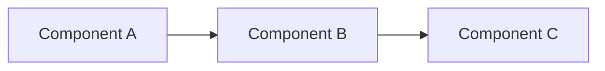

# Lesson Title

## Conceptual Overview

_Explain the concept incrementally, avoiding hand-waving. Start with the "why" before the "how"._

```text
[Diagram: ASCII or Mermaid showing system relationships]
```

**Key Insight**: One sentence connecting this concept to embodied intelligence and Physical AI.

## System Architecture



**Components**:
- **Component A**: Purpose and responsibility
- **Component B**: Purpose and responsibility
- **Component C**: Purpose and responsibility

## Core Technologies

| Technology | Version | Purpose |
|------------|---------|---------|
| ROS 2 | Humble | Middleware communication |
| Python | 3.10+ | Node implementation |

**Verification**:
```bash
ros2 --version
python3 --version
```

## Hands-on Implementation

### Step 1: [Action Description]

[Clear instructions with context]

```python
# code-example-id: example-01
# Problem: What problem does this solve?
# Assumptions: What does it assume?
# Failure: What breaks if this fails?

# Your code here with comments explaining WHY
```

**Expected Output**:
```
[Exact output the reader should see]
```

### Step 2: [Next Action]

[Continue step-by-step...]

## Failure Modes & Debugging

### Issue: [Error Name]

**Symptoms**: What the reader observes

**Diagnosis**:
```bash
[diagnostic command]
```

**Resolution**: How to fix the issue

### Issue: [Another Error]

**Symptoms**: ...
**Diagnosis**: ...
**Resolution**: ...

## What's Next

**You learned**:
- Key concept 1
- Key concept 2
- Key concept 3

**Coming up**: Preview of the next lesson/module

**Prerequisites for next**:
- [ ] Completed this lesson's examples
- [ ] Verified output matches expected
- [ ] Understood failure modes
